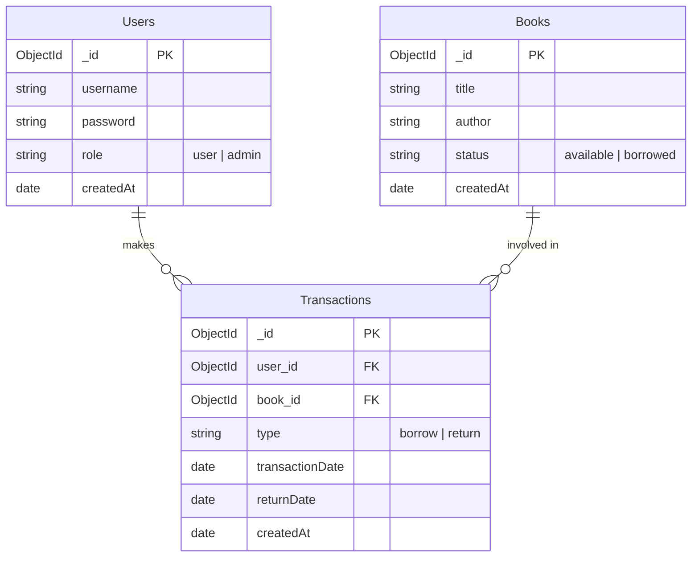

# Entity Relationship Diagram

## Data Dictionary

### Users
- `_id`: Unique identifier
- `username`: User's login name
- `password`: Hashed password
- `role`: Role of the user (admin or member)
- `createdAt`: Date of registration

### Books
- `_id`: Unique identifier
- `title`: Title of the book
- `author`: Author of the book
- `status`: Current status ('available' or 'borrowed')
- `createdAt`: Date added

### Transactions
- `_id`: Unique identifier
- `user_id`: Reference to Users
- `book_id`: Reference to Books
- `type`: Type of transaction ('borrow' or 'return')
- `transactionDate`: Date of borrowing
- `returnDate`: Date of return (null if not returned yet)
